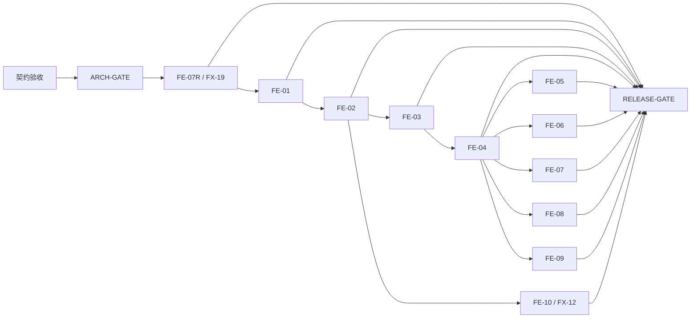

# Agent Config Manager 前端本地票据集

> 契约状态：冻结的产品基线 v0.2 与前端契约 v0.2（2026-08-10）；`CR-FE-001` 保留为历史已确认条款
> 当前 tracker 状态：FE-07R 为 `ready-for-agent`；FE-01 至 FE-10 为 `blocked`
> 产品事实来源：`docs/product/Agent_Config_Manager_MVP_产品决策基线_v0.2.md`（Frozen）
> 前端事实来源：`docs/frontend/Agent_Config_Manager_前端契约_v0.2.md`（Frozen）
> 技术方案与影响复核：`docs/architecture/Agent_Config_Manager_MVP_技术方案_v0.1.md`（已验收，`ARCH-GATE` closed，2026-07-27）及 `docs/architecture/Agent_Config_Manager_MVP_技术方案_v0.1_影响复核_addendum_2026-08-10.md`

## 状态与推进规则

票据只能按 `blocked → ready-for-agent → done` 推进：

- `blocked`：契约尚未验收、`ARCH-GATE` 未关闭或任一直接 blocker 未有完成证据；不得编码、测试实现或声称可交付。
- `ready-for-agent`：契约已验收、`ARCH-GATE` 已关闭，且全部直接 blocker 均为 `done` 并附有完成证据；此时才可启动该单票据实现。
- `done`：该票据的全部验收项已有可复核证据，票据规定的聚焦验证已通过，且独立只读审查已处理有效 finding。没有证据不得仅以“已实现”标记完成。

`Acceptance state: Frozen` 只锁定票据验收文本，绝不等同票据 `Status`、`done`、实际运行或 gate evidence。更新 blocker 时只能引用 closed gate record，或直接前置票据的 `done` 状态及其完成证据；不能用 planning、冻结文档、设计、模拟输出或未验收技术方案解除 blocker。每次状态更新必须同步更新本 README 的 frontier：仅列出所有直接 blocker 已 `done` 且自身仍非 `done` 的票据；没有该类票据时明确写“无”。`RELEASE-GATE` 是发布验收门禁，不是实现票据，也不改变 10 张 FE 行为票据的数量。

## 工作规则

- 真相链依次为冻结产品基线 v0.2、冻结前端契约 v0.2、技术方案 v0.1 与其 2026-08-10 addendum、冻结 FE acceptance、实际 ticket evidence；上位冻结文档不能被当作 runtime、ticket closure 或 gate evidence。
- `ARCH-GATE` 已关闭；当前唯一 frontier 是 FE-07R。它完成并具 actual-read 证据前，FE-01 继续 blocked；`RELEASE-GATE` 继续受 FE-07R 与 FE-01 至 FE-10 的完成证据阻塞。
- 技术方案验收与 FE-07R acceptance 冻结均没有生成实现或运行证据。FE-07R 的最小 bootstrap/harness 及其验证命令实际运行并留下符合层级的 evidence 后，才可更新相应 ticket 状态。
- 每张票据的正式关闭入口为 `npm run verify:ticket -- FE-XX`；当前全部为 `planned / unverified`。底层 Cargo、Vitest 或 WebdriverIO 命令只能用于定位，不能单独关闭票据。
- 验证证据写入 `.artifacts/verification/<FE-ID>/<run-id>/` 并保持 L0–L4 provenance；mock、test harness 与 production artifact 不能互相替代。
- 每个 FE 票据必须在一个全新上下文中完成；FE-07R 是唯一 foundation/read slice，FE-01 至 FE-10 各自交付可演示用户行为，不拆横向组件、状态层或 API 封装任务。
- 每个 fixture 只有一张主票据；其他票据可复用同一敏感或安全不变量，但不得夺取 fixture 的主归属。
- 下位票据不能改变产品基线、前端契约或技术方案；发现冲突时提交最小 Change Request，不自行扩展范围。

## 实现票据 tracker

本 tracker 精确记录 11 张 implementation tickets：1 张 foundation/read ticket（FE-07R）与 10 张行为 tickets（FE-01 至 FE-10）。状态只由下表的直接 gate/ticket evidence 决定。

| Ticket | 切片 | Status | Direct blockers / evidence |
|---|---|---|---|
| FE-07R | foundation/read；FX-19 project applicability projection | ready-for-agent | 无 ticket；`ARCH-GATE` closed record（2026-07-27） |
| FE-01 | 行为；FX-01 只读工作台 | blocked | FE-07R `done` 且具其 actual-read evidence |
| FE-02 | 行为；FX-02、FX-03 | blocked | FE-01 `done` evidence |
| FE-03 | 行为；FX-04 | blocked | FE-02 `done` evidence |
| FE-04 | 行为；FX-05、FX-16、FX-18 | blocked | FE-03 `done` evidence |
| FE-05 | 行为；FX-08、FX-15、FX-17 | blocked | FE-04 `done` evidence |
| FE-06 | 行为；FX-09、FX-10、FX-11 | blocked | FE-04 `done` evidence |
| FE-07 | 行为；FX-07 | blocked | FE-04 `done` evidence |
| FE-08 | 行为；FX-06、FX-14 | blocked | FE-04 `done` evidence |
| FE-09 | 行为；FX-13 | blocked | FE-04 `done` evidence |
| FE-10 | 行为；FX-12 | blocked | FE-02 `done` evidence |

## 依赖图

该图没有环：`RELEASE-GATE` 只在全部 11 张 implementation tickets（FE-07R 加 10 张 FE 行为 tickets）完成后承接全回归、真实 adapter、构建、打包和负向范围检查。`F7R → R` 是 release blocker 边，不改变唯一新增的 FE-ticket 依赖边 `FE-07R → FE-01`；图中仍无 FE-07M、`FE-08 → FE-06` 或 `FE-06 → FE-10` 等 forbidden edge，也不反向解除任何 FE blocker。

## Fixture 主归属

| Fixture | 主票据 |
|---|---|
| FX-01 | FE-01 |
| FX-02、FX-03 | FE-02 |
| FX-04 | FE-03 |
| FX-05、FX-16、FX-18 | FE-04 |
| FX-06、FX-14 | FE-08 |
| FX-07 | FE-07 |
| FX-08、FX-15、FX-17 | FE-05 |
| FX-09、FX-10、FX-11 | FE-06 |
| FX-12 | FE-10 |
| FX-13 | FE-09 |
| FX-19 | FE-07R |

## Frontier

当前唯一实现 frontier 是 FE-07R。FE-01 必须等待 FE-07R `done` 与其 provenance-appropriate actual-read evidence；FE-02 至 FE-10 的直接 blocker 同样尚未完成，继续保持 `blocked`；`RELEASE-GATE` 继续保持 `blocked`。
