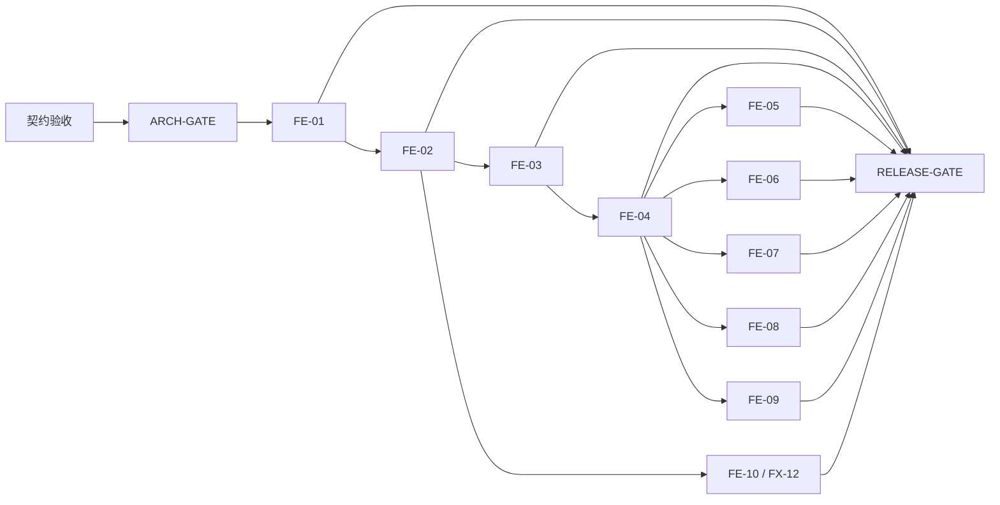

# Agent Config Manager 前端本地票据集

> 契约状态：accepted（2026-07-27）；`CR-FE-001` 已确认纳入；前端契约重新冻结
> 当前 tracker 状态：FE-01 为 `ready-for-agent`；FE-02 至 FE-10 仍为 `blocked`
> 父规格：`docs/frontend/Agent_Config_Manager_前端契约_v0.1.md`
> 产品事实来源：`docs/product/Agent_Config_Manager_MVP_产品决策基线_v0.1.md`
> 技术方案：`docs/architecture/Agent_Config_Manager_MVP_技术方案_v0.1.md`（已验收，`ARCH-GATE` closed，2026-07-27）

## 状态与推进规则

票据只能按 `blocked → ready-for-agent → done` 推进：

- `blocked`：契约尚未验收、`ARCH-GATE` 未关闭或任一直接 blocker 未有完成证据；不得编码、测试实现或声称可交付。
- `ready-for-agent`：契约已验收、`ARCH-GATE` 已关闭，且全部直接 blocker 均为 `done` 并附有完成证据；此时才可启动该单票据实现。
- `done`：该票据的全部验收项已有可复核证据，票据规定的聚焦验证已通过，且独立只读审查已处理有效 finding。没有证据不得仅以“已实现”标记完成。

更新 blocker 时，只能引用直接前置票据的 `done` 状态和其完成证据；不能用计划、设计、模拟输出或未验收技术方案解除 blocker。每次状态更新必须同步更新本 README 的 frontier：仅列出所有直接 blocker 已 `done` 且自身仍非 `done` 的票据；没有该类票据时明确写“无”。`RELEASE-GATE` 是发布验收门禁，不是实现票据，也不改变 10 张 FE 行为票据的数量。

## 工作规则

- `ARCH-GATE` 已关闭；当前只允许从 FE-01 开始按依赖实施。`RELEASE-GATE` 继续受 FE-01 至 FE-10 完成证据阻塞。
- 技术方案验收本身没有生成实现或运行证据。FE-01 建立最小 bootstrap 后，才可把相应验证命令从“命令契约”标为“已验证可运行”。
- 每张票据的正式关闭入口为 `npm run verify:ticket -- FE-XX`；当前全部为 `planned / unverified`。底层 Cargo、Vitest 或 WebdriverIO 命令只能用于定位，不能单独关闭票据。
- 验证证据写入 `.artifacts/verification/<FE-ID>/<run-id>/` 并保持 L0–L4 provenance；mock、test harness 与 production artifact 不能互相替代。
- 每个 FE 票据必须在一个全新上下文中完成；每个票据交付可演示用户行为，不拆横向组件、状态层或 API 封装任务。
- 每个 fixture 只有一张主票据；其他票据可复用同一敏感或安全不变量，但不得夺取 fixture 的主归属。
- 下位票据不能改变产品基线、前端契约或技术方案；发现冲突时提交最小 Change Request，不自行扩展范围。

## 依赖图

该图没有环：`RELEASE-GATE` 只在全部 10 张 FE 行为票据完成后承接全回归、真实 adapter、构建、打包和负向范围检查；它不反向解除任何 FE blocker。

## Fixture 主归属

| Fixture | 主票据 |
|---|---|
| FX-01 | FE-01 |
| FX-02、FX-03 | FE-02 |
| FX-04 | FE-03 |
| FX-05、FX-16、FX-18 | FE-04 |
| FX-06、FX-14 | FE-08 |
| FX-07 | FE-07 |
| FX-08、FX-15、FX-17 | FE-05 |
| FX-09、FX-10、FX-11 | FE-06 |
| FX-12 | FE-10 |
| FX-13 | FE-09 |

## Frontier

当前唯一实现 frontier 是 FE-01。FE-02 至 FE-10 的直接 blocker 尚未完成，仍保持 `blocked`；`RELEASE-GATE` 继续保持 `blocked`。
