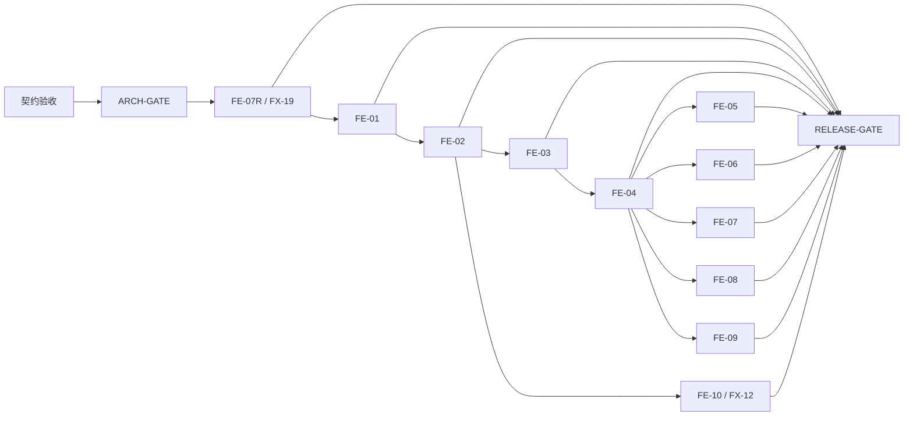

# Agent Config Manager 前端本地票据集

> 契约状态：冻结的产品基线 v0.2 与前端契约 v0.2（2026-08-10）；`CR-FE-001` 保留为历史已确认条款
> 当前 tracker 状态：FE-07R、FE-01、FE-02、FE-03、FE-10 为 `done`；FE-04 为唯一 `ready-for-agent` frontier；FE-05 至 FE-09 为 `blocked`；`RELEASE-GATE` 继续 `blocked`
> 产品事实来源：`docs/product/Agent_Config_Manager_MVP_产品决策基线_v0.2.md`（Frozen）
> 前端事实来源：`docs/frontend/Agent_Config_Manager_前端契约_v0.2.md`（Frozen）
> 技术方案与影响复核：`docs/architecture/Agent_Config_Manager_MVP_技术方案_v0.1.md`（已验收，`ARCH-GATE` closed，2026-07-27）、`docs/architecture/Agent_Config_Manager_MVP_技术方案_v0.1_影响复核_addendum_2026-08-10.md`，以及冻结的 `docs/architecture/Agent_Config_Manager_MVP_技术方案_v0.1_prepared-secret_addendum_2026-08-21.md`

## 状态与推进规则

票据只能按 `blocked → ready-for-agent → done` 推进：

- `blocked`：契约尚未验收、`ARCH-GATE` 未关闭或任一直接 blocker 未有完成证据；不得编码、测试实现或声称可交付。
- `ready-for-agent`：契约已验收、`ARCH-GATE` 已关闭，且全部直接 blocker 均为 `done` 并附有完成证据；此时才可启动该单票据实现。
- `done`：该票据已完成其 MVP gate：最小 contract/implementation、L0/L1、必要 L2、ticket 自身真实产品安全负例、只在真实产品边界所需的 isolated L3，以及独立功能复审。最低记录必须包含可审计 commit、实际测试命令/结果、未覆盖边界和独立 review；没有证据不得仅以“已实现”标记完成。

`Acceptance state: Frozen` 只锁定票据验收文本，绝不等同票据 `Status`、实际运行或 gate evidence。更新 blocker 时只能引用 closed gate record，或直接前置票据的 `done` 状态及其自身完成记录；不能用 planning、冻结文档、设计、模拟输出或未验收技术方案解除 blocker。每次状态更新必须同步更新本 README 的 frontier：仅列出所有直接 blocker 已 `done` 且自身仍非 `done` 的票据；没有该类票据时明确写“无”。`RELEASE-GATE` 是发布验收门禁，不是实现票据，也不改变 10 张 FE 行为票据的数量。

PF、performance/stress/platform hardening、复杂 trusted-runner provenance/hash/digest 和逐票 `verify:ticket`/formal closure 统一后置到 release/optimization；它们未执行时只能标为 `deferred`，不得被说成通过、formal closure 或 release-ready，也不新增 `functional-done` 等并行状态。该后置不弱化真实产品安全：外部路径/symlink、敏感 grant/revision、prepare/apply/write/recovery、权限/跨资产、不受信任输入与真实磁盘 fail-closed 仍在各票 MVP gate 中保留。

## 工作规则

- 真相链依次为冻结产品基线 v0.2、冻结前端契约 v0.2、技术方案 v0.1 与其 2026-08-10 addendum、冻结的 `docs/architecture/Agent_Config_Manager_MVP_技术方案_v0.1_prepared-secret_addendum_2026-08-21.md`、冻结 FE acceptance、实际 ticket evidence；上位冻结文档不能被当作 runtime、ticket closure 或 gate evidence。
- `ARCH-GATE` 已关闭；FE-07R、FE-01、FE-02 的历史 done/evidence 保持原样。FE-03 与 FE-10 已按自身 MVP records 直接 `done`：分别由 PR #22/#27 与 PR #23/#27 的实现、实际功能检查和独立 review 支持；PF/formal/`verify:ticket` 都仍为 deferred，不能互借或升级为 release credit。当前唯一实现 frontier 是 FE-04；`RELEASE-GATE` 继续受 FE-04 至 FE-09 的 MVP 完成及统一 release/optimization 阻塞。
- FE-04 的 MVP 实现必须吸收 PR #24/#25 已冻结、以 `docs/architecture/Agent_Config_Manager_MVP_技术方案_v0.1_prepared-secret_addendum_2026-08-21.md` 为准的 prepared-secret addendum：prepare 对零到多个 `SensitiveSegmentRef` 配对完成权威验证后才建立 core entry；same-target revision drift、conflict 或 explicit reprepare 时清除旧 core entry、旧 grant 与旧 bound identity，frontend 仅保留同一 target 的 replacement 作为 unbound input，显式 reprepare 必须取得 newly authorized grant；只有 asset/file/segment/scope/surface target identity 改变、TTL 到期或 cancel/discard 才立即清零 frontend/core 两侧。apply 继续 single-use，成功后 authoritative reread cleanup，crash 只允许 loss/reprepare。该 addendum 是 FE-04 的真实 write/recovery/sensitive L3 输入，不授予实现、L3、PF、formal 或 release credit，也不改写其冻结规则。
- FE-07R 的最小 bootstrap/harness 已建立并实际运行；其 synthetic FX-19 actual-read evidence 不证明真实用户配置、生产 artifact、L2、PF 或写路径，也不得借给 FE-01 closure。
- FE-01 的 PF-01 是 development acceptance（L2 Vite dev/mock + L3 debug test-harness）：automatic result 仍为 `fail`/exit `1` 且 `samplingRun=false`，只因 exact manual `accepted-with-waiver`、final physical evidence 与 lineage 成立而闭合；相关性能债务为 `deferred / post-optimization`。它不是 automatic PASS 或 release/reference evidence，不能解除 `RELEASE-GATE`。
- FE-07R、FE-01、FE-02 的历史 `npm run verify:ticket -- FE-XX` closure 与 accepted-with-waiver facts 保持原样。对新的 MVP gate，底层 Cargo、Vitest 与 WebdriverIO 的实际命令/结果连同 commit、未覆盖边界和独立 review 构成票据自身记录；不要求为每票新增 registry、manifest 或 verifier route。FE-03 与 FE-10 的该类记录已在各自 ticket 与 `TEST-EXECUTION-ORDER` 中列明；它们没有 PF/formal/`verify:ticket` 或 release credit。
- 验证证据写入 `.artifacts/verification/<FE-ID>/<run-id>/` 并保持 L0–L4 provenance；mock、test harness 与 production artifact 不能互相替代。
- 每个 FE 票据必须在一个全新上下文中完成；FE-07R 是唯一 foundation/read slice，FE-01 至 FE-10 各自交付可演示用户行为，不拆横向组件、状态层或 API 封装任务。
- 每个 fixture 只有一张主票据；其他票据可复用同一敏感或安全不变量，但不得夺取 fixture 的主归属。
- 下位票据不能改变产品基线、前端契约或技术方案；发现冲突时提交最小 Change Request，不自行扩展范围。

## 实现票据 tracker

本 tracker 精确记录 11 张 implementation tickets：1 张 foundation/read ticket（FE-07R）与 10 张行为 tickets（FE-01 至 FE-10）。状态只由下表的直接 gate/ticket evidence 决定。

| Ticket | 切片 | Status | Direct blockers / evidence |
|---|---|---|---|
| FE-07R | foundation/read；FX-19 project applicability projection | done | `ARCH-GATE` closed；run `20260810T071547Z` L0/L1/L3 actual-read PASS；独立复审无 P0–P3 |
| FE-01 | 行为；FX-01 只读工作台 | done | 自身 closure：`.artifacts/verification/FE-01/latest-clean-subject-accepted-with-waiver.json`；FE-07R evidence 非本票 credit |
| FE-02 | 行为；FX-02、FX-03 | done | 自身 closure：`.artifacts/verification/FE-02/latest-clean-subject-accepted-with-waiver.json`；FE-01 `done` evidence 非本票 credit |
| FE-03 | 行为；FX-04 | done | 自身 MVP record：`27cf50a…` + `b0e3e14…`；自身 L0/L1/必要 L2、grant/敏感明文负例与独立功能复审；PF/formal deferred |
| FE-04 | 行为；FX-05、FX-16、FX-18 | ready-for-agent | `ARCH-GATE` closed；FE-03 MVP `done` record；FE-04 必须自行取得真实 write/recovery/sensitive L3 credit |
| FE-05 | 行为；FX-08、FX-15、FX-17 | blocked | FE-04 `done` evidence |
| FE-06 | 行为；FX-09、FX-10、FX-11 | blocked | FE-04 `done` evidence |
| FE-07 | 行为；FX-07 | blocked | FE-04 `done` evidence |
| FE-08 | 行为；FX-06、FX-14 | blocked | FE-04 `done` evidence |
| FE-09 | 行为；FX-13 | blocked | FE-04 `done` evidence |
| FE-10 | 行为；FX-12 | done | 自身 MVP record：`7882f0c…` + `b0e3e14…`；自身 L0/L1/必要 browser L2、`view` grant 安全负例与独立功能复审；无 L3/PF，formal deferred |

## 依赖图

该图没有环：`RELEASE-GATE` 只在全部 11 张 implementation tickets（FE-07R 加 10 张 FE 行为 tickets）完成后承接全回归、真实 adapter、构建、打包和负向范围检查。`F7R → R` 是 release blocker 边，不改变唯一新增的 FE-ticket 依赖边 `FE-07R → FE-01`；图中仍无 FE-07M、`FE-08 → FE-06` 或 `FE-06 → FE-10` 等 forbidden edge，也不反向解除任何 FE blocker。

## Fixture 主归属

| Fixture | 主票据 |
|---|---|
| FX-01 | FE-01 |
| FX-02、FX-03 | FE-02 |
| FX-04 | FE-03 |
| FX-05、FX-16、FX-18 | FE-04 |
| FX-06、FX-14 | FE-08 |
| FX-07 | FE-07 |
| FX-08、FX-15、FX-17 | FE-05 |
| FX-09、FX-10、FX-11 | FE-06 |
| FX-12 | FE-10 |
| FX-13 | FE-09 |
| FX-19 | FE-07R |

## Frontier

当前实现 frontier 是 FE-04。FE-03 与 FE-10 已按各自 MVP record `done`，不借用 FE-02 的 accepted-with-waiver evidence，也不取得 PF/formal/release credit；FE-07R 的 actual-read evidence 仍只曾解除 FE-01 direct blocker，不计入 FE-01 closure。FE-05 至 FE-09 的直接 blocker FE-04 尚未完成，继续保持 `blocked`；`RELEASE-GATE` 继续保持 `blocked`。
